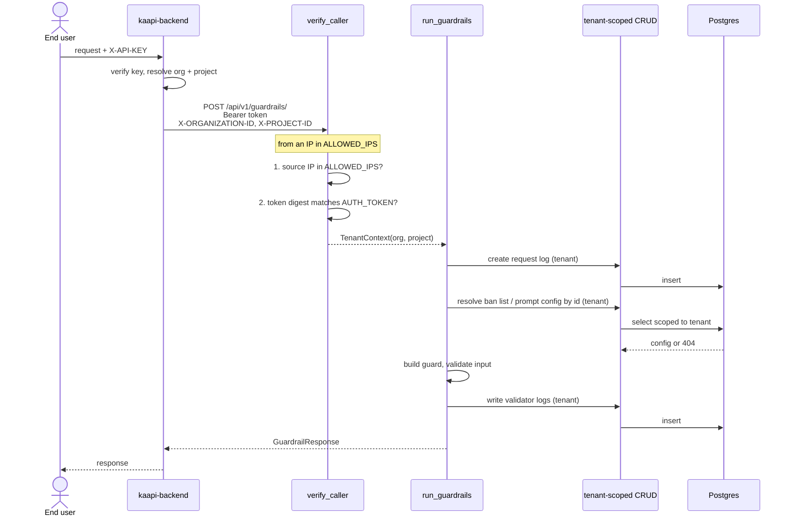
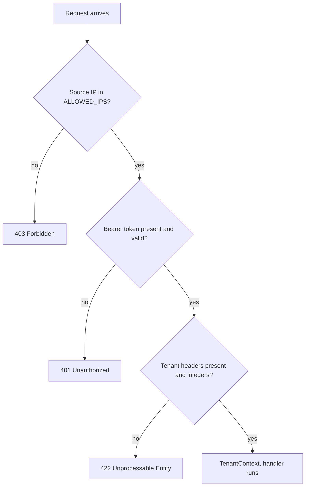

# Auth for kaapi-guardrails — design proposal

## Problem

Two endpoints (`guardrails`, `validator_configs`) check a shared bearer token, then read
`organization_id` / `project_id` from the query string or request body. The token proves the caller
is allowed in; nothing proves which tenant it is allowed to touch. Anyone with the token can read or
change any tenant's data by editing a query parameter.

Two other endpoints (`ban_lists`, `llm_prompt_configs`) instead resolve an `X-API-KEY` by calling
back to kaapi-backend on every request. Correct, but it leaves us with a second auth contract and a
runtime dependency on the auth service.

## Proposal

Treat kaapi-guardrails as an internal service with one caller: kaapi-backend. kaapi-backend
authenticates the end user and resolves the tenant before calling. Guardrails would no longer handle
`X-API-KEY` and would no longer call back.

Each request would carry:

- `Authorization: Bearer <token>` — shared secret
- `X-ORGANIZATION-ID` / `X-PROJECT-ID` — tenant, resolved upstream
- and must arrive from an IP listed in `ALLOWED_IPS`

Token and IP together mean a leaked token alone is not enough to reach the service. Since only a
caller passing both can set the tenant headers, the tenant becomes something established by
authentication rather than claimed by the caller.

The property worth having: the same dependency that authenticates a route also supplies its tenant,
so a route cannot be written without one.

### Alternative considered

Keeping the tenant in the request body. Rejected because 9 of the 15 endpoints are GET or DELETE and
cannot carry a body — we would end up with body for writes and query params for reads, and the
tenant would stay a per-route parameter each handler has to remember to forward.

## Contract

All routes except health-check would require the three headers. Health-check stays open for the
Docker healthcheck.

- Source IP not whitelisted → 403, checked first so a bad IP never learns whether the token was valid
- Missing or wrong token → 401
- Missing or non-integer tenant headers → 422

## Request flow

A guardrail run end to end. The tenant is resolved once, upstream, and everything downstream is
scoped by it.



The lookups in the middle are the part the current design gets wrong: `ban_list_id` and
`topic_relevance_config_id` are resolved against the tenant, and today that tenant comes from the
request body — so a caller can point them at another tenant's records.

Rejections, in order:



The IP check comes first on purpose: a caller from an unexpected origin gets `403` whether or not
its token was valid, so the response never confirms a working token to the wrong network.

`GET /utils/health-check/` has no dependency and skips all three.

## Changes required

- `config.py` — add `ALLOWED_IPS` (comma-separated; required in production, empty disables the check
  locally). Drop `KAAPI_AUTH_URL`, `KAAPI_AUTH_TIMEOUT`.
- `deps.py` — replace both existing dependencies with one, `verify_caller`, returning the tenant.
  Delete the `X-API-KEY` callback.
- Routes — all move to the same `AuthDep`; `validator_configs` drops its tenant query parameters.
- `GuardrailRequest` — remove `organization_id` / `project_id`, so sending them fails loudly rather
  than being silently honoured.
- Pass the tenant from the auth context into the request log, validator logs, and the ban-list and
  prompt-config lookups in the guardrails path. These are tenant-scoped reads a caller can currently
  redirect.

## Testing

New tests for the IP check, token check, the ordering between them, and header validation. Existing
tests move from API keys and query params to tenant headers. The cross-tenant 404 tests already in
the suite serve as the regression net.

Running the full suite locally needs the Guardrails hub validators installed and a Postgres
instance.

## Rollout

```
AUTH_TOKEN="<sha256 of the bearer token>"
ALLOWED_IPS="10.0.3.14"        # kaapi-backend's source IP
```

This is a breaking change; the two services need to be released together:

1. Set `ALLOWED_IPS` and confirm it matches kaapi-backend's actual egress IP. If NAT or a different
   interface is in play, every request will 403 — the most likely deploy failure.
2. Update kaapi-backend to send the tenant headers and stop sending `X-API-KEY` and body/query
   tenant fields.
3. Deploy guardrails.

If kaapi-backend later moves to a new IP, `ALLOWED_IPS` has to be updated or traffic stops. That is
the ongoing cost of this approach.

## Limits

- The IP check would read the real connection source and ignore `X-Forwarded-For`, which callers can
  forge. Fine today since nothing proxies this service, but it would need revisiting if a load
  balancer is added, as every request would then arrive from the balancer's IP.
- Rotating the token needs a coordinated change on both sides; there is no overlap window.
- Out of scope: per-route permissions (one caller, one trust level), CIDR ranges (worth adding if the
  backend autoscales), mTLS (stronger and immune to IP churn, but needs certificate infrastructure).
